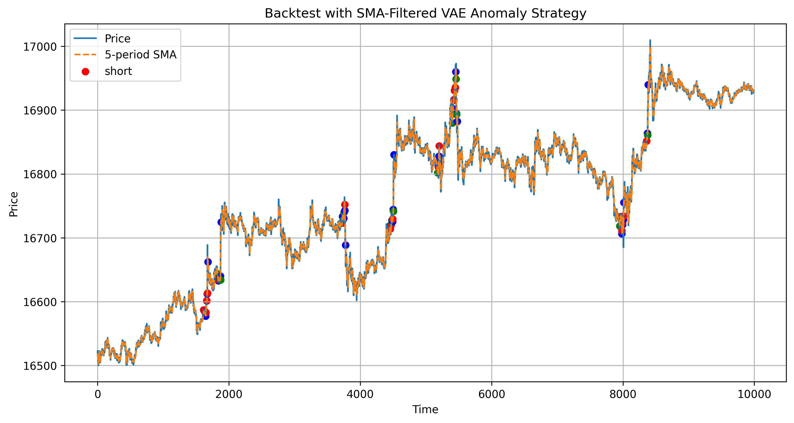
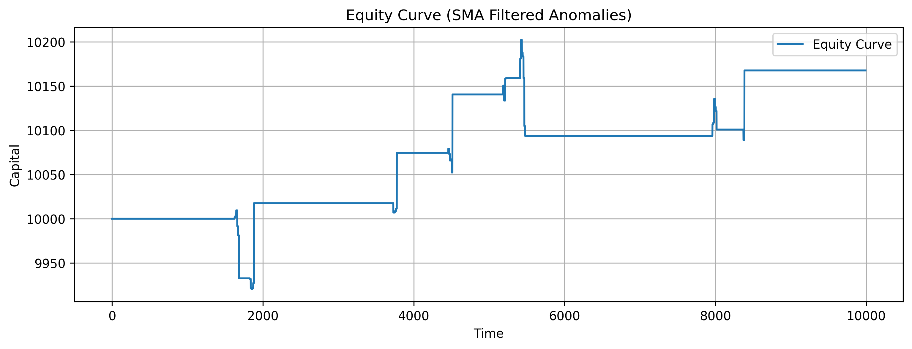

# Anomaly Detection in Bitcoin Using Variational Autoencoders (VAE)

**Hello!** This project explores the use of a Variational Autoencoder (VAE) for anomaly detection in Bitcoin price data. VAEs are generative models commonly used to compress and reconstruct data, but they also learn a continuous probabilistic representation of underlying features. This made me wonder: _Can we leverage that latent space to identify anomalies and trade on them?_

---

# Motivation

Rather than using off-the-shelf anomaly detection tools, I wanted to build something with mathematical grounding and interpretability. The VAE architecture fit the bill and gave me a chance to explore deep generative modeling in a financial setting.

---

# VAE Intuition

A VAE consists of three core components:

- **Encoder**: Maps input data (e.g., Bitcoin price sequences) to two vectors: a mean and a standard deviation. These define a Gaussian distribution in the latent space.
- **Latent Space**: A sample is drawn from this distribution—adding stochasticity and encouraging structure.
- **Decoder**: Attempts to reconstruct the original input from the sampled latent vector.

The training objective balances two losses:

- **Mean Squared Error (MSE)** – How well the model reconstructs the input.
- **KL Divergence** – Ensures the latent distribution remains close to a standard normal.

---

## Implementation

- Fetched historical OHLCV data using the [ccxt](https://github.com/ccxt/ccxt) library from Binance.
- Computed log returns and created time-windowed sequences.
- Built a VAE model in PyTorch.
- Ramped up KL divergence weighting across epochs to encourage meaningful latent structure.
- Flagged anomalies using reconstruction error:  
  `threshold = mean_error + 3 * std_error`

---

## Strategy

Once anomalies were detected, I implemented a simple SMA-based trading rule:
- Go **long** when price is **below** the SMA at an anomaly point.
- Go **short** when price is **above** the SMA at an anomaly point.

This was a deliberately simple framework to test whether the VAE anomaly signal could offer predictive edge.

> **Note:** The KL term may collapse to near-zero without intervention. I ramped the `β` (KL weight) over training epochs. Future versions could experiment with different regularization or annealing schedules.

---

## Results

The model did identify clusters of anomalies at local extrema. The trading strategy, though basic, showed some profitability under select hyperparameter settings. This confirmed that VAEs may offer value in identifying rare structural deviations in price behavior.
- Total Return: 1.68%
- Sharpe Ratio: 0.14
- Max Drawdown: -1.11%
- Win Rate: 51.22%
- Average Return per Trade: 4.09
- Total Trades: 41, Profitable Trades: 21

## 📎 Future Work

- Try more sophisticated trading logic, such as a momentum strategy, which are well suited to crypto in my opinion.
- Experiment with other anomaly detection models (e.g., GANs, LSTMs)
- Compare with simpler ML models, like a standard linear regression to see if all the frills of deep learning are worth the trouble

---

Thanks for reading! Feel free to clone the repo, play with the code, and reach out if you try your own variant.
